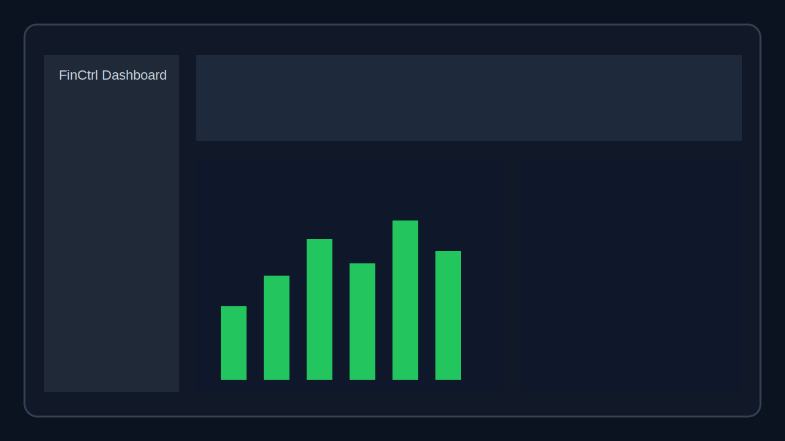
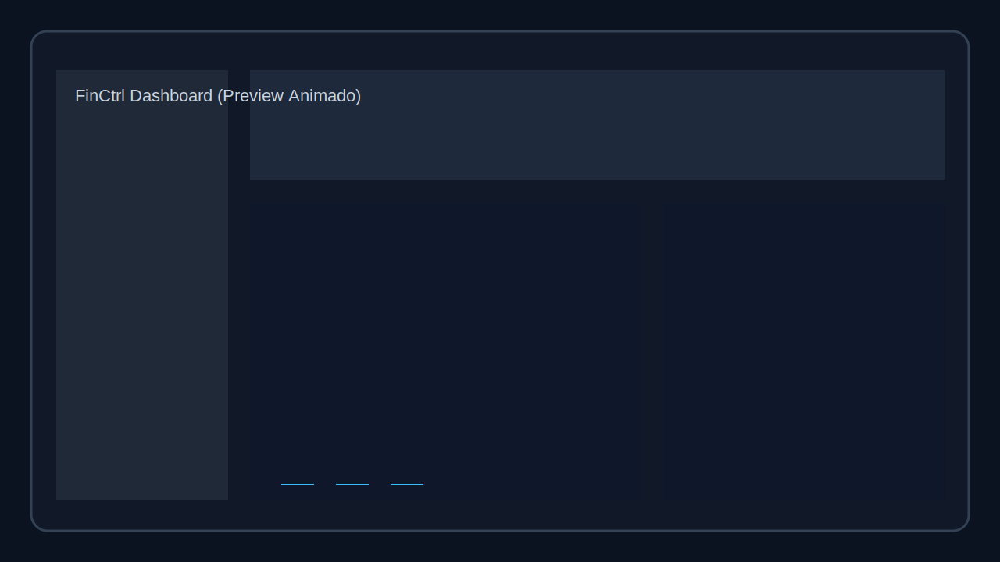
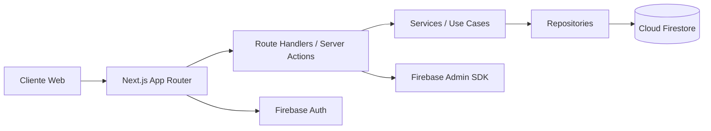

# FinCtrl v2

[](https://github.com/finctrl/finctrl/actions/workflows/ci.yml)
[](https://github.com/finctrl/finctrl/actions/workflows/coverage.yml)
[](https://vercel.com)

Aplicação web de controle financeiro pessoal com autenticação segura, isolamento por usuário e arquitetura escalável usando Next.js + Firebase.

## Stack

- Next.js 16 (App Router)
- TypeScript strict
- Tailwind CSS
- Firebase Auth + Firestore + Admin SDK
- React Hook Form + Zod
- Recharts
- Vitest + Playwright

## Screenshots / GIF do Dashboard

> Atualize os arquivos em `docs/assets/` quando tiver capturas reais do ambiente de produção.




## Architecture



### Camadas

- **UI (app/components/features):** renderização das páginas e componentes do dashboard.
- **Application (server/use-cases):** regras de negócio e orquestração dos fluxos.
- **Data (server/repositories):** acesso ao Firestore por contexto de usuário.
- **Infra (lib/firebase):** clientes Admin/Client, autenticação e App Check.

## Estrutura principal

```txt
app/
  (public)/
    landing/page.tsx
    login/page.tsx
  (app)/
    dashboard/page.tsx
    debts/page.tsx
    expenses/page.tsx
    goals/page.tsx
    fgts/page.tsx
    plan/page.tsx
    diagnostics/page.tsx
    settings/page.tsx
  api/
    auth/session/route.ts
    auth/logout/route.ts
    diagnostics/feedback/route.ts
    admin/health/route.ts
components/
features/
lib/firebase/
server/
types/
```

## Segurança adotada

- Session cookie `httpOnly` para sessão do Firebase Admin.
- Middleware protegendo rotas privadas.
- Validação de payload com Zod.
- Validação básica de App Check em endpoint sensível.
- Firestore Rules com isolamento por `request.auth.uid`.

## Rodando localmente

```bash
npm install
npm run dev
```

## Scripts úteis

```bash
npm run lint
npm run typecheck
npm run test
npm run test:e2e
```

## Releases semânticas

- Pipeline automatizado com **Release Please** (`.github/workflows/release.yml`).
- Tags com prefixo `v`, por exemplo: `v1.0.0`, `v1.1.0`.
- Histórico público em [`CHANGELOG.md`](./CHANGELOG.md).

## Preview por Pull Request

- Cada PR pode gerar um deploy temporário via Vercel (`.github/workflows/preview.yml`).
- O link do preview é publicado automaticamente nos comentários da PR.
- Secrets necessários: `VERCEL_TOKEN`, `VERCEL_ORG_ID`, `VERCEL_PROJECT_ID`.

## Roadmap sugerido

1. Implementar CRUD completo em `expenses`, `debts`, `goals` e `fgts` com Server Actions.
2. Substituir mocks do dashboard por agregações reais do Firestore.
3. Integrar Firebase Emulator Suite no fluxo local.
4. Completar cobertura de testes (unit, integração de regras e e2e completo).
