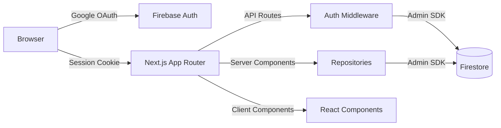
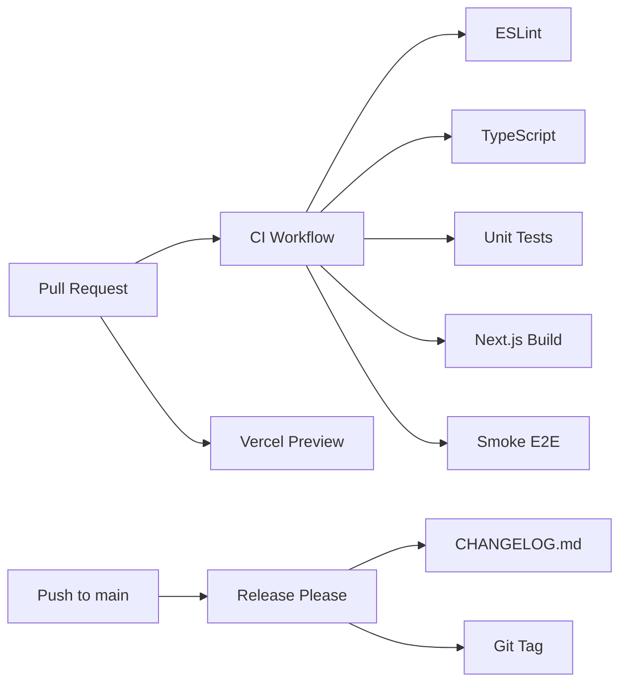

<div align="center">

# FinCtrl v2

**Personal Finance Control Platform**


[](https://github.com/fernando-msa/finctrl/actions/workflows/ci.yml)
[](https://github.com/fernando-msa/finctrl/actions/workflows/coverage.yml)
[](https://vercel.com)


</div>

---

## Overview

Full-stack web application for personal financial management built with modern TypeScript architecture. Features secure Google authentication, per-user data isolation, automated financial diagnostics, and debt optimization strategies (Avalanche/Snowball).

**Key highlights:**

- 60 automated tests (unit + integration)
- CI/CD pipeline with quality gates (lint, typecheck, test, build, smoke E2E)
- Multi-layer security (session cookies, App Check, Firestore rules, security headers)
- Responsive design with mobile-first approach
- Automated release management with semantic versioning

---

## Tech Stack

| Layer          | Technology                                                      |
| -------------- | --------------------------------------------------------------- |
| **Framework**  | Next.js 16 (App Router, Server Components)                      |
| **Language**   | TypeScript 5.8 (strict mode)                                    |
| **UI**         | React 19.1, Tailwind CSS 3.x                                    |
| **Forms**      | React Hook Form + Zod validation                                |
| **Charts**     | Recharts                                                        |
| **Database**   | Cloud Firestore (Firebase)                                      |
| **Auth**       | Firebase Auth (Google OAuth) + Admin SDK (server-side sessions) |
| **Testing**    | Vitest (unit) + Playwright (E2E)                                |
| **Linting**    | ESLint 9 (flat config) + Prettier                               |
| **CI/CD**      | GitHub Actions (4 workflows) + Release Please                   |
| **Deployment** | Vercel                                                          |

---

## Features

### Financial Management

- **Dashboard** — KPI cards + bar chart with income, expenses, debts, goals, and monthly balance
- **Expenses** — CRUD with 7 categories, recurring flag, monthly replication
- **Incomes** — 6 source categories with monthly tracking
- **Debts** — Track creditors, principal, interest rates, and status (active/settled/overdue)
- **Goals** — Financial targets with progress tracking and due dates
- **FGTS** — Brazilian employment fund management with modality tracking

### Intelligence

- **Financial Plan** — Automated debt prioritization using Avalanche (highest interest first) or Snowball (smallest balance first) strategies
- **Diagnostics** — 0-100 financial score based on 4 weighted factors: debt ratio, average interest rate, income commitment, and savings capacity
- **Smart Dashboard** — Aggregates data from all modules with real-time KPIs

### Security

- **Authentication** — Google OAuth via Firebase Auth with multi-tier server verification (Admin SDK → JWKS fallback)
- **Session Management** — httpOnly cookies with 5-day TTL, SameSite=Lax, Secure in production
- **Data Isolation** — Per-user Firestore collections with security rules
- **App Check** — Firebase App Check validation on sensitive endpoints
- **Security Headers** — HSTS, CSP, X-Frame-Options, X-Content-Type-Options, Referrer-Policy, Permissions-Policy
- **Input Validation** — Zod schemas on all API routes

---

## Architecture

```
finctrl/
├── app/                          # Next.js App Router
│   ├── (public)/                 #   Public routes (landing, login, releases)
│   ├── (app)/                    #   Protected routes (dashboard, expenses, etc.)
│   │   ├── layout.tsx            #     Sidebar nav + auth guard
│   │   └── [section]/page.tsx    #     Server components for data fetching
│   └── api/                      #   REST API routes
│       ├── auth/                 #     Session management
│       ├── expenses/             #     CRUD + replication
│       ├── debts/                #     CRUD
│       ├── goals/                #     CRUD
│       ├── fgts/                 #     CRUD
│       ├── incomes/              #     CRUD
│       ├── settings/             #     User profile
│       ├── diagnostics/          #     Feedback (App Check protected)
│       └── metrics/              #     Analytics events
├── components/                   # React client components
│   ├── [section]/                #   Feature-specific managers
│   └── ui/                       #   Shared UI (nav, table, pagination, filters)
├── features/                     # Business logic (client-side)
│   ├── auth/                     #   Google sign-in flow
│   ├── dashboard/                #   Summary aggregator
│   └── diagnostics/              #   Financial score calculator
├── server/                       # Server-side business logic
│   ├── repositories/             #   Firestore CRUD operations
│   ├── services/                 #   Domain services (debt prioritization)
│   └── use-cases/                #   Orchestration (financial plan generation)
├── lib/                          # Infrastructure
│   ├── firebase/                 #   Admin SDK, client SDK, auth, App Check
│   └── export/                   #   CSV export utility
├── types/                        # TypeScript domain types
├── tests/
│   ├── unit/                     #   Vitest unit tests (60 tests)
│   └── e2e/                      #   Playwright E2E tests
└── proxy.ts                      # Middleware for route protection
```

### Data Flow



### Design Patterns

- **Repository Pattern** — Abstracts Firestore access behind typed interfaces
- **Use Case Layer** — Orchestrates business logic (e.g., financial plan generation)
- **Server/Client Separation** — Server components for data fetching, client components for interactivity
- **Multi-tier Auth Fallback** — Admin SDK → JWKS verification → dev-only JWT decode
- **Zod-first Validation** — All API inputs validated at the boundary

---

## Getting Started

### Prerequisites

- Node.js 24.13.1 (see `.nvmrc`)
- Firebase project with Auth + Firestore enabled
- Google OAuth credentials

### Installation

```bash
git clone https://github.com/fernando-msa/finctrl.git
cd finctrl
npm install
cp .env.example .env.local
```

### Environment Variables

```env
# Client-side (NEXT_PUBLIC_*)
NEXT_PUBLIC_FIREBASE_API_KEY=
NEXT_PUBLIC_FIREBASE_AUTH_DOMAIN=
NEXT_PUBLIC_FIREBASE_PROJECT_ID=
NEXT_PUBLIC_FIREBASE_APP_ID=
NEXT_PUBLIC_FIREBASE_MEASUREMENT_ID=

# Server-side
FIREBASE_PROJECT_ID=
FIREBASE_CLIENT_EMAIL=
FIREBASE_PRIVATE_KEY=
```

### Development

```bash
npm run dev          # Start dev server (http://localhost:3000)
npm run test         # Run unit tests
npm run test:e2e     # Run E2E tests
npm run lint         # Lint code
npm run typecheck    # Type check
npm run validate     # Full quality check (lint + typecheck + test)
```

---

## Testing

### Unit Tests (Vitest)

60 tests across 11 test files covering:

| Module           | Tests                                       | Coverage |
| ---------------- | ------------------------------------------- | -------- |
| Repositories (6) | CRUD operations, replication, normalization | 100%     |
| Services         | Debt prioritization (avalanche/snowball)    | 100%     |
| Use Cases        | Financial plan generation                   | 100%     |
| Features         | Dashboard summary, financial score          | 100%     |
| Middleware       | Route protection, auth redirects            | 100%     |

```bash
npm run test           # Run all unit tests
npm run test:watch     # Watch mode
```

### E2E Tests (Playwright)

Smoke tests covering:

- Landing page CTA visibility
- Public releases page
- Auth redirect for protected routes

```bash
npm run test:e2e:smoke    # Run smoke tests
npm run test:e2e          # Full E2E suite
```

---

## CI/CD Pipeline



**4 GitHub Actions workflows:**

- `ci.yml` — Lint, typecheck, test, build, smoke E2E on every PR/push
- `coverage.yml` — Unit test coverage gate
- `preview.yml` — Vercel preview deployment per PR
- `release.yml` — Automated semantic versioning with Release Please

**Git Hooks (Husky):**

- `pre-commit` — ESLint fix + Prettier on staged files
- `pre-push` — Full validation (lint + typecheck + test)

---

## Security

| Measure          | Implementation                                                                          |
| ---------------- | --------------------------------------------------------------------------------------- |
| Authentication   | Google OAuth + Firebase Auth + multi-tier server verification                           |
| Session          | httpOnly cookie, Secure, SameSite=Lax, 5-day TTL                                        |
| Data Isolation   | Firestore rules: `request.auth.uid == uid`                                              |
| Input Validation | Zod schemas on all 15+ API routes                                                       |
| App Check        | Firebase App Check on sensitive endpoints                                               |
| Headers          | HSTS, CSP, X-Frame-Options, X-Content-Type-Options, Referrer-Policy, Permissions-Policy |
| Secret Scanning  | Gitleaks in CI                                                                          |
| Dependency Audit | npm audit in CI                                                                         |

---

## Release History

See [CHANGELOG.md](CHANGELOG.md) for full release history.

| Version | Date       | Highlights                                       |
| ------- | ---------- | ------------------------------------------------ |
| v2.5.0  | 2026-04-17 | Settings persistence, monthly income integration |
| v2.4.0  | 2026-04-12 | Goals + FGTS CRUD, public releases page          |
| v2.3.0  | 2026-04-10 | Income management, responsive tables, CSV export |
| v2.2.0  | 2026-04-05 | Debt CRUD, financial plan, diagnostics           |
| v2.1.0  | 2026-04-02 | Expense replication, dashboard charts            |
| v2.0.0  | 2026-03-28 | Next.js App Router migration, full rewrite       |

---

## License

This project is licensed under the MIT License — see [LICENSE](LICENSE) for details.

---

<div align="center">

**Built by [Fernando S. De Santana Junior](https://github.com/fernando-msa)**

[LinkedIn](https://linkedin.com/in/fernando-msa) · [GitHub](https://github.com/fernando-msa)

</div>
